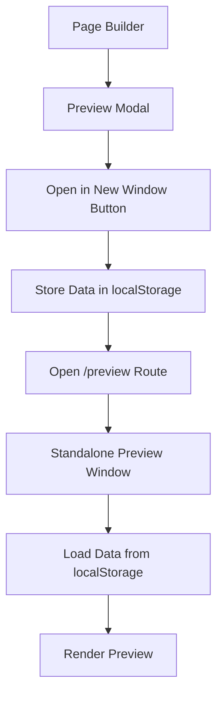

# 🖥️ Preview Mode Feature Documentation

## Overview

The Preview Mode feature allows users to preview their page builder content in both modal view and a standalone window with multiple viewport options. This enhancement provides a professional preview experience for course content created in the SmartClass page builder.

## ✨ Features

### 1. **Modal Preview** (Enhanced)
- **Quick preview within the page builder interface**
- **Viewport selection**: Desktop, Tablet, Mobile
- **Multi-page navigation** with slide controls
- **Auto-scaling** and centering of content
- **NEW: "Open in New Window" button** for standalone preview

### 2. **Standalone Preview Window** (New)
- **Full-screen preview experience**
- **Independent window** that can be moved and resized
- **Professional presentation mode**
- **Same viewport options** as modal preview
- **No distractions** from the builder interface

## 🎯 Use Cases

1. **Content Review**: Teachers can review their course content in a clean, distraction-free environment
2. **Presentation Mode**: Present course content to students or colleagues in full-screen mode
3. **Responsive Testing**: Test how content looks across different device sizes
4. **Content Validation**: Ensure content renders correctly before publishing

## 🔧 Technical Implementation

### Files Created/Modified

#### New Files
- `src/page-builder/pages/PreviewPage.tsx` - Standalone preview component
- Routes added to both App.tsx files for `/preview` path

#### Modified Files
- `src/page-builder/builder/PreviewModal.tsx` - Added "Open in New Window" functionality

### Data Flow



### Data Structure

The preview system uses a simplified data structure that's compatible with the existing page builder:

```typescript
interface PreviewData {
  title: string;
  description?: string;
  pages: PreviewPage[];
  currentPageIndex: number;
}

interface PreviewPage {
  id: string;
  title: string;
  elements: Element[];
  background?: {
    color?: string;
    image?: string;
  };
}
```

## 🚀 How to Use

### From the Page Builder

1. **Open Preview Modal**
   - Click the "Preview" button in the page builder toolbar
   - The modal will open showing your current content

2. **Open Standalone Preview**
   - In the preview modal, click the "New Window" button
   - A new browser window will open with the standalone preview

### Navigation Controls

- **Viewport Switcher**: Desktop 📱 Tablet 📱 Mobile icons
- **Page Navigation**: Left/Right arrows (if multiple pages)
- **Scale Indicator**: Shows current zoom level
- **Close Button**: Close preview window

## 📱 Responsive Design

The preview supports three viewport sizes:

| Viewport | Width | Height | Use Case |
|----------|-------|--------|----------|
| Desktop  | 1200px| 800px  | Computer screens |
| Tablet   | 768px | 1024px | iPad-like devices |
| Mobile   | 375px | 667px  | Phone screens |

## 🔄 Technical Features

### Auto-scaling Algorithm
- Calculates content bounds automatically
- Scales content to fit viewport while maintaining aspect ratio
- Centers content within the available space
- Handles both single and multi-page content

### Element Rendering
- Supports all page builder element types (text, images, buttons, containers)
- Maintains proper parent-child relationships
- Preserves styling and positioning
- Handles nested elements correctly

### Performance Optimizations
- Uses localStorage for data transfer (no URL size limits)
- Minimal data serialization
- Efficient re-rendering on viewport changes

## 🛡️ Browser Compatibility

- **Modern browsers** with localStorage support
- **Pop-up blocker handling** - shows user-friendly message if blocked
- **Cross-origin considerations** - works within same domain

## 🐛 Error Handling

### Graceful Fallbacks
- **No data available**: Shows helpful error message with return option
- **Pop-up blocked**: Alerts user to allow pop-ups
- **Invalid data**: Falls back to safe defaults
- **Missing elements**: Handles empty pages gracefully

### User Feedback
```typescript
// Error states handled:
- No preview data found
- Failed to parse preview data
- Empty or invalid course data
- Missing pages or elements
```

## 🎨 UI/UX Improvements

### Visual Enhancements
- **Professional header** with course/page information
- **Clean, distraction-free interface**
- **Smooth transitions** between viewports
- **Intuitive navigation controls**
- **Responsive layout** that works on all screen sizes

### Accessibility
- **Keyboard navigation** support
- **Screen reader friendly** button labels
- **High contrast** controls
- **Clear visual feedback** for interactions

## 🔮 Future Enhancements

### Potential Improvements
1. **Export to PDF** - Generate PDF versions of previews
2. **Fullscreen API** - True fullscreen mode support
3. **Print Optimization** - Better print styling
4. **Annotation Mode** - Add comments and feedback
5. **Sharing Links** - Generate shareable preview URLs
6. **Preview History** - Keep track of recent previews

### Integration Opportunities
1. **LMS Integration** - Direct preview in learning management systems
2. **Student View** - Show exactly what students will see
3. **Assessment Mode** - Preview interactive assessments
4. **Collaboration Tools** - Real-time collaborative previewing

## 📋 Testing Checklist

### Functional Tests
- [ ] Modal preview opens correctly
- [ ] New window button works
- [ ] Standalone preview loads data
- [ ] Viewport switching functions
- [ ] Multi-page navigation works
- [ ] Content scales properly
- [ ] Close button functions
- [ ] Error states display correctly

### Browser Tests
- [ ] Chrome/Chromium
- [ ] Firefox
- [ ] Safari
- [ ] Edge
- [ ] Mobile browsers

### Content Tests
- [ ] Single page content
- [ ] Multi-page content
- [ ] Empty pages
- [ ] Complex nested elements
- [ ] Various element types
- [ ] Background images/colors

## 🚨 Known Limitations

1. **Pop-up Blockers**: Users need to allow pop-ups for new window feature
2. **localStorage Size**: Very large courses might hit storage limits
3. **Cross-origin**: Won't work across different domains
4. **Print Styling**: May need optimization for printing

## 👥 Target Users

### Primary Users
- **Teachers/Tutors**: Creating and reviewing course content
- **Content Creators**: Designing educational materials
- **Administrators**: Reviewing course submissions

### Secondary Users
- **Students**: Viewing finalized course content
- **IT Staff**: Troubleshooting display issues
- **Quality Assurance**: Testing content before release

## 📞 Support Information

### Common Issues
1. **Preview not opening**: Check pop-up blocker settings
2. **Content not loading**: Clear browser cache and try again
3. **Scaling issues**: Try different viewport modes
4. **Navigation problems**: Ensure JavaScript is enabled

### Debug Information
The preview system logs detailed information to the browser console for troubleshooting:
- Data loading status
- Element rendering details
- Scaling calculations
- Error conditions

---

*This documentation covers the Preview Mode feature implementation for SmartClass Page Builder v2.0*

**Last Updated**: January 2025  
**Version**: 2.0.0  
**Status**: ✅ Implemented and Ready for Testing
